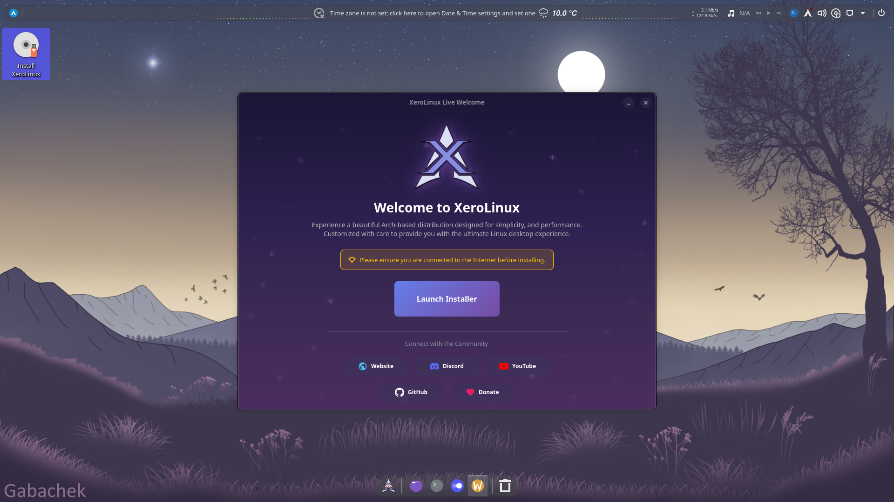

    

<h1 align="center">🔥 XeroLinux KDE Plasma 🔥</h1>

    

### Profiles

This project now has 2 profiles, `FOSS` which is for **Intel/AMD** systems and `nVidia` for **nVidia RTX** users. The `Demo` profile is to be ignored as it is only intended for *Demonstration* purposes. Also one important thing to note is; that *older* **nVidia** GPUs are no longer supported. We follow **Arch Upstream**. If they drop support, then so do we. The whole point of **XeroLinux** was to not stray too far from **Arch Linux**. Just something to keep in mind going into this. 

### Building ISO

As per nature of this project, being **FOSS**, feel free to fork, modify to your needs and build it. When it comes to build script, none is provided as there are many ways of doing it. The one being used was tailored to the way things are being done which might not align with yours. To learn more about how to create your own, here's a guide by [**Wummit.dev**](https://blog.ummit.dev/posts/linux/distribution/archlinux/archlinux-build-your-own-kernel-archlinux_iso/). What you will be donating for is the convenience of not having to do that yourself ;)

### Support / Issues

Distro support and/or feature requests is available on the project *Community* [**Discord**](https://discord.gg/5sqxTSuKZu) server. It's being run by the community *for* the community. Not by me. Keep that in mind.

Most of my free time goes into working on **XeroLinux**, so I’m not always around. Electricity here isn’t exactly 24/7, so my main machine runs in scheduled “uptime windows.” When it’s on, I’m elbows-deep in configs, polishing details, breaking things on purpose, and fixing them faster than last time. If it boots cleanly, that’s a win.

Thanks for the support. ❤️‍🔥
